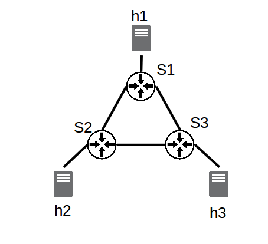
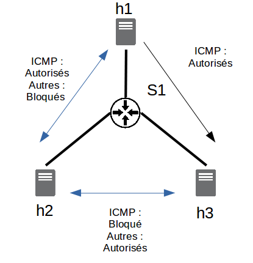

<center> <h1>Discovering SDN</h1> </center>

This practical training should allow you to understand a bit more about how SDN works, as well as its interest and possible applications through :
* the use of a virtual network emulator (Mininet);
* the analysis of the Openflow protocol;
* the use of an SDN controller: Ryu (of course, this is only one controller and many others are available on the market: ONOS, OpenDayLight, etc.);
  - development of new applications
  - discovery of Ryu's REST API
 
Note that you will deploy an environment based on the Docker technology, this aims to 1) introduce you the NVF technology 2) practice docker more extensively.

*Note:* To set the keyboard to "azerty" mode you can use the following command in the VM: `sudo setxkbmap fr`

## 0. short theoretical introduction: What is SDN? ##

The SDN (Software Defined Networking) technology appeared to be a disruptive technology that is gradually being adopted by many companies and this for a wide range of use cases.

Three questions can be asked to understand this technology and its benefits:

**Q.I** What are the main differences between a traditional network architecture and an SDN-based network architecture?

**Q.II** What are the main benefits of this technology/new network architecture?

**Q.III** What are the different SDN models?

Note: To answer these questions, you can potentially use these two sources of information: 
https://www.vmware.com/fr/topics/glossary/content/software-defined-networking.html and 
https://www.silicon.fr/hub/colt-hub/10-choses-a-savoir-pour-comprendre-le-sdn

## 1. Mininet

Mininet, based on OS virtualization, is an emulator allowing to create and interact locally with a virtual network.

### 1.1 Getting started

In our example, Mininet will be deployed within a docker container.

To do so, you can use the following docker image: https://hub.docker.com/r/iwaseyusuke/mininet/ 

You will have to pull it and run it in a custom network (**as during the first lab you will have to create a bridge network**).

Once the docker will be running, you should be able to run Mininet with the following command: `mn`

Once you have typed this command, you are inside the mininet shell. There are several commands that can be useful:

```console
mininet> exit #exit mininet

mininet> help # to display the commands that can be used with this emulator

mininet> h1 ping h2 # shows how to ping from h1 to h2
```

**Q.1** What is the default topology of mininet (how many openflow switches and how many hosts)?

**Q.2** What are the pingall, iperf, xterm, ifconfig, dump, links and net commands in mininet used for?

**Q.3** The switches of your mininet instance are configured as "learning switch" by default.
  * What is a learning switch? What is the result of pingall when the learning switch is used?
  * Quit mininet and restart by disabling the controller (`--controller none`). What is the result of the pingall? So what does the role of the controller seem to be in an SDN architecture?

*Note:* In this part as in the rest of this tutorial, some commands can be used, especially `mn -c` which will allow you to clean the mininet in case of problems.

*Note* : The command we will use later will have other parameters:
`sudo mn --switch=ovsk,protocols=OpenFlow13`

We will see in the following sections why the switch type and protocol type are important.

### 1.2 Defining custom topologies

Mininet natively allows to define a large number of topologies through the use of different arguments.
So far the topology we have used is composed of two hosts (h1,h2) and a switch (s1).

The command we have used so far therefore corresponds to a tree topology with a depth of 1 and a fanout of 2 and could have been written as follows:
`sudo mn --topo=tree,depth=1,fanout=2`

**Q.4** If we now modify this topology and create a topology with a depth of 3 and a fanout of 4, how many switches are there? How many hosts? How many links and finally how many controllers? To which switch is host 25 connected? (To answer this question, you will need to use the different commands associated with Mininet that you discovered in part 1.1)

Mininet has a python API. Thanks to this, using this python API, it is possible in a few lines to create your own custom topologies.

<figure style="text-align:center">
 
 <figcaption>Fig.1 - Architecture to be implemented</figcaption>
</figcaption>

So now we will try to create our own topology corresponding to the image above. A simple topology consisting of 3 switches and three hosts.

To create this architecture, you will be able to use the code below as a guide.

```ruby
from mininet.topo import Topo

class CustomTopo(Topo):
    "Simple topology example."

    def __init__(self):
        "Create custom topo."

        # Initialize topology
        Topo.__init__(self)

        # Add hosts and switch
        s1 = self.addSwitch('s1')
        h1 = self.addHost('h1')

        # Add links
        self.addLink(h1,s1)

topos = {'customtopo': (lambda: CustomTopo())}

```

Note that 3 APIs are essential to the definition of a topology: `addSwitch`, `addHost` and `addLink`.

**Q.5** Create a python file in which you will use these different functions to create a topology that will correspond to the topology described in the figure above.

Once this code is written you will be able to run it with mininet to check that it works properly.

To do this, you will be able to use for the first time the controller that will be presented and used in the rest of this tutorial: Ryu. There are many SDN controllers, among which ONOS and OpenDayLight are the best known. However Ryu is also a used controller, easy to learn and install. For this reason it was chosen for this tutorial, and it is a good way to learn about network software programming. 

What we will do here is simply:
  * Use the Ryu controller in its basic operation, 

  * Tell mininet that the controller to use is not the default controller but the Ryu controller (we will simply "plug" the Ryu controller on the topology we just defined).

**The Ryu controller, as Mininet, will run in its own Docker Container**

Therefore, you will have to use a docker image of a Ryu controller (https://hub.docker.com/r/osrg/ryu) and to run in within the same local docker network.

Note that you can get the ip adress of the docker container, within this sub network, with the following command : `ip a`.

Once this container is running, should should be able to launch the controller will the following command:
```console
ryu-manager ryu/ryu/app/simple_switch_13.py
```

Once this is done, within the Mininet container you will have to indicate to your virtual network to use this controller: 

```console
sudo mn --custom <lien vers fichier custom>.py --topo customtopo --controller remote,ip=<IP_adress of_the_Ryu_container> --link tc --switch=ovsk,protocols=OpenFlow13
```

*Note:* The `--link tc` option should allow to specify different types of options concerning the links (bandwidth, delay, loss) and is necessary.

**Q.6-7** Now that this topology is in place, perform a test: What is the result of a `pingall`?

**Q.8** Using a command you saw earlier, specify the links between the different interfaces (s1-eth1:h1-eth0, etc.). By modifying your custom topology file, remove the link between s1 and s2. Try to do a `pingall` again, what happens?

As you can see in the `ryu/ryu/app/` folder, and as we will see in the rest of this tutorial, there are many different examples of the use of Ryu and the controllers and switches. We can observe that some of them (notably simple_switch_stp.py) propose a use of STP.

**Q.9** What is the Spanning Tree Protocol (STP)? What could be its interest here? Could it help us to correct the problem we discovered? 

 ## 2. Openflow ##

As you know, an SDN architecture is composed of three main layers: Application - Control - Infrastructure. The most common protocol for communication between the controller layer (SDN controllers) and the infrastructure layer (switches) is Openflow. It is a communication protocol that allows the controller to have access to the "Forwarding plane" of the switches and routers. Different versions of this protocol exist and in this tutorial, as you may have already understood, we will focus on version 1.3.

### 2.1 Return to the operation of traditional switches ###

**Q.10** Recall the operation of traditional L2 switches (i.e. level 2 switches of the OSI model):
  * Is there a separation between the control plane and the data plane?
  * What type of data does the Forwarding Table contain? What type of data is processed at level 2?
  * How is this table updated?

### 2.2 Openflow-based SDN switches

We will now try to understand what is the main difference between these traditional switches and the openflow switches.

To do this, we're going to take two steps, first theoretical and then practical.

**Q.11** To begin with, list the main messages that OpenFlow must allow to be exchanged (Hello, PacketIn, PacketOut, FlowRemoved, Echo, FlowMod, EchoReq, EchoRes). Remember to indicate the sender (controller or switch) and the receiver (controller or switch) as well as their purpose. For this you can use the documentation here: https://overlaid.net/2017/02/15/openflow-basic-concepts-and-theory/. Don't forget that we are currently working with version 1.3.

We are now going to try to see what it can do in practice. To do this we will first need to restart a Ryu controller with a level 2 switch:

`ryu-manager ryu/ryu/app/simple_switch_13.py`

We will then launch the Mininet emulator with a linear topology composed of 6 switches:

`sudo mn --controller=remote,ip=<IP> --switch=ovsk,protocols=OpenFlow13 --topo=linear,6`

What we want to do now is to observe the exchanges between the different switches, and between the switches and the controller.

To do this we will launch Wireshark and observe the exchanges that occur between switches.

**Note : Wireshark must be launched with sudo. If it is not installed on your local machine (where it will be launched you should download it!**.

Now run the pingall command.

**Q.12** What kind of OpenFlow commands are captured by wireshark, according to the theoretical part what is their role?

**Q.13** If you run the pingall command again, what difference do you observe with the previous question? Why?

**Q.14** How do these SDN switches work? What is the main difference with traditional switches (legacy devices running without SDN)?

**Q.15** What type of data is processed here by the forwarding plane (see packetIn and packetOut content)? What is the role of the controller here?

By using the command line tool `ovs-ofctl` you can also supervise and manage the OpenvSwitch switches of the network you have just created. Thus it is possible to retrieve information about the current status of an OpenvSwitch, including its characteristics, configuration and input tables. Indeed, the virtual switch or switches used here are OpenvSwitch switches. Since we will access different information through this interface in part 3, it seems interesting to understand how it works.

**Q.16** What is an OpenvSwitch, and what can we do with it? What are the components and tools ovs-vsctl, ovs-dpctl, ovsdb-server and ovs-ofctl used for? (docs.openvswitch.org/en/latest/intro/what-is-ovs/)

**Q.17** What information is used to retrieve the following commands, for example?

**Note: if you want to open a second terminal on a running container, you can use the following command: `docker exec -it container-name /bin/bash`**

```console
$ ovs-vsctl show
$ ovs-ofctl -O OpenFlow13 show s1
$ ovs-ofctl -O Openflow13 dump-flows s1
```
## 3. Ryu ##

Now that we have understood how to use the Mininet emulator (creation of a virtual network) and the fundamentals of OpenFlow (type of messages exchanged, role of the controller) we will try to develop applications within the Ryu controller. We will focus on the South interface and the exchanges between controller and infrastructure and discover some of the possibilities offered by Ryu:
  * Gui 
  * Back to the STP
  * Adding features to the controller:
    - Setting up a level 2 controller
    - Definition of level 3 rules
    - Definition of level 4 rules
  * Ryu and REST API
    - Getting started
    - Firewalling
    - QoS

### 3.0 Gui Topology

First, to reuse commands/concepts discovered during the last lab, we will try to display the Topology Viewer Gui offered by Ryu: https://ryu.readthedocs.io/en/latest/gui.html

This gui topology can be launched with the following command (**with the controller already running**) within the Ryu container: `ryu run --observe-links ryu/app/gui_topology/gui_topology.py`

This Gui topology run on the port 8080. We will want to display it at: http://localhost:8080.

You will therefore have to connect port 8080 of the Ryu container to port 8080 of your machine.

Once this is done and once the topology is displayed within your browser call me to show me that it works.

### 3.1 Back to the Spanning Tree Protocol

In the first part of this tutorial we saw that in the presence of redundancies the network could be disrupted. We are going to use here a possible application of Ryu, the Spanning Tree Protocol to solve this problem. To do this, we will again work with the topology that you defined in part 1.2.

Thus, we will :
  - in a first terminal, launch a Ryu SDN application based on the STP protocol: `ryu-manager simple_switch_stp_13.py`;
  - in a second terminal, run the mininet command to use the topology you defined in 1.2.
  
**Note: The file simple_switch_stp_13.py is in the MOR_TP/my_apps folder! You can 1) use docker cp to copy that within your container or 2) install it in the container and git clone this project** 

**Q.18** If you look at what the terminal in which the Ryu controller was launched, you can see that a number of returns are already displayed. What are they (LISTEN, BLOCK, LEARN, etc.)? Make an inventory of the status of the ports of the different switches.

**Q.19** In the Mininet container, display the list of requests exchanged on the eth2 port of s1: `tcpdump -i s1-eth2 arp`. Now, still in mininet, try to ping h1 with h2. Wait a minute, what do you see?

**Q.20** If you turn off the eth2 interface of s2 (*ip link set dev s1-eth2 down*), what happens to the controller? What is the status of the ports now? What can we conclude about the STP?

**Q.21** If we turn eth2 back on, what happens? What can we conclude about the STP?

### 3.2 Adding functionality to the controller ###

So far we have only used pre-defined Ryu features with existing and available implementations. What we are going to do now, through various practical implementations, is to try to understand how Ryu works and to put some new features into action.

*Note: At first, a simple topology composed of a switch and three hosts will be used in this part*.

#### 3.2.1 Implementing a level 2 controller ####

To start with, we will try to understand how a level 2 switch controller is implemented. To do so, we will start from the code present in `my_apps/basic_switch.py`. Since we are going to modify this script, you may want to make a copy of it to keep a working base.

If you open the file `my_apps/basic_switch.py` or the copy you have just made, you will see that this file contains several essential elements.

First of all, the different libraries necessary for the functioning of the application :
```ruby
from ryu.base import app_manager    # permet d'accéder à l'application

# différents éléments permettant de capturer des événements correspondant à la réception d'un packet OpenFlow
from ryu.controller import ofp_event    
from ryu.controller.handler import CONFIG_DISPATCHER, MAIN_DISPATCHER
from ryu.controller.handler import set_ev_cls

from ryu.ofproto import ofproto_v1_3    # spécification de la version d'OpenFlow à utiliser
from ryu.lib.packet import packet
from ryu.lib.packet import ethernet
from ryu.lib.packet import ether_types
...
```

But also the definition of the class (derived from app manager) as well as the choice of the OpenFlow protocol used (here 1.3) and the definition of the constructor.

We can observe that this class is composed of three main functions, a first one which allows to manage the *features* of the switches, a second one which allows to add a new flow to a switch and a third one which allows to manage the *PacketIn*. What we will try to do here is to understand and modify the *PacketIn* function.

**Q.22** Using the different functions you listed in **2.2.1.**, try to understand the *PacketIn* function. What is the command you listed earlier that you find here? What is its purpose?

**Q.23** Run this Ryu controller (`ryu run my_apps/basic_switch.py`) and a basic Mininet topology and observe the frames exchanged in Wireshark. If you run pingall like you did in part **2.2**, what do you observe? How do you explain this difference? What seems to be missing in the program `basic_switch.py`?

To finish this part, retrieve from the file `ryu/ryu/app/simple_switch_13.py` the missing part of the code and check that it works correctly.

#### 3.2.2 Definition of level 3 rules ####

We have focused so far on switches and level 2 (OSI) decision making using an example application proposed by Ryu to implement a controller managing this type of equipment. What we are going to do now is to try to modify the existing code to transform the application into an application working at level 3.

**Q.24** To begin with, recall the difference between a level 2 switch and a level 3 switch. What is the benefit of implementing Layer 3 flow management rules?

*Note: To answer this question, you can use https://www.aussiebroadband.com.au/blog/difference-layer-3-layer-2-networks/ 

Within the *PacketIn* function, what we want to do is to send a new rule to the switch to prevent a new packetIn from occurring. However, this time this rule will not be at MAC level but at IP level.
To do this, we will modify the part of the *PacketIn* function, corresponding to the `FlowMod` :

```ruby
# install a flow to avoid packet_in next time
if out_port != ofproto.OFPP_FLOOD:
   match = parser.OFPMatch(in_port=in_port, eth_dst=dst, eth_src=src)
   # verify if we have a valid buffer_id, if yes avoid to send both
   # flow_mod & packet_out
   if msg.buffer_id != ofproto.OFP_NO_BUFFER:
       self.add_flow(datapath, 1, match, actions, msg.buffer_id)
       return
   else:
       self.add_flow(datapath, 1, match, actions)
```

As you can see below, what we are going to do is to add a new condition, if it is a packet of type IP, we are going to retrieve the information concerning the source and the destination

```ruby
# check IP Protocol and create a match for IP
if eth.ethertype == ether_types.ETH_TYPE_IP:
    ip = pkt.get_protocol(ipv4.ipv4)
    srcip = ip.src
    dstip = ip.dst

    # lIGNE A MODIFIER
    match = parser.OFPMatch(eth_type=ether_types.ETH_TYPE_IP,IP_SRC=srcip,IP_DEST=dstip)

    # verify if we have a valid buffer_id, if yes avoid to send both
    # flow_mod & packet_out
    if msg.buffer_id != ofproto.OFP_NO_BUFFER:
        self.add_flow(datapath, 1, match, actions, msg.buffer_id)
        return
    else:
        self.add_flow(datapath, 1, match, actions)
```

Replace with the above code:

```ruby
   match = parser.OFPMatch(in_port=in_port, eth_dst=dst, eth_src=src)
   # verify if we have a valid buffer_id, if yes avoid to send both
   # flow_mod & packet_out
   if msg.buffer_id != ofproto.OFP_NO_BUFFER:
       self.add_flow(datapath, 1, match, actions, msg.buffer_id)
       return
   else:
       self.add_flow(datapath, 1, match, actions)
```

What you will have to do is to modify the match line so that the rule no longer applies to a MAC address but to an IP address, so this line should now look like :

```ruby
match = parser.OFPMatch(eth_type=ether_types.ETH_TYPE_IP,IP_SRC=srcip,IP_DEST=dstip)
```
What you will only have to change on this line are the keywords *IP_SRC* and *IP_DEST*. To find out which keywords to use, you can use: https://osrg.github.io/ryu-book/en/html/openflow_protocol.html.

**Once you have made this change, check that it has been taken into account. To do this: 
  * restart the controller with the file you have just modified,
  * run a basic Mininet configuration again and ping it; 
  * use the command `sudo ovs-ofctl -O Openflow13 dump-flows s1` to see if the rule you just defined appears.

OpenFlow has many advantages. For example, it is very easy to add new rules to modify the behavior of the switch and add new features. For instance, you could decide to duplicate all or part of the traffic destined for a port to another port, for example to "plug in" a device controlling the traffic.

**Q.26** When looking at the different fields of a *FlowMod* command, which part corresponds to the instructions (see https://programmerall.com/article/60675193/)? Which field is present in the addflow function?

**Q.27** Now that you have identified the field that needs to be changed, add a new rule and duplicate the traffic to host 10.0.0.3.

To verify that the changes you just made work:
  * Run a Ryu controller with the program you just modified,
  * Run Mininet with a switch and 3 hosts (always remembering to specify the protocol!),
  * In a third terminal, scan the TCP packets received by host 3: `sudo tcpdump -i s1-eth3`,
  * In a fourth terminal, scan the TCP packets received by host 2: `sudo tcpdump -i s1-eth2`,
  * In Mininet, ping host 1 to host 2, check that the traffic is duplicated and that host 3 receives it as well.

-- KEEP THIS PART FOR THE END OF THE SESSION --
#### 3.2.3 Setting Level 4 Rules ####

**Q.28** What is the difference between level 3 and level 4 (OSI model)? What could be the interest of setting up rules at this level?

A typical case could be load balancing between different servers, a client assumes that it is connected to the IP of machine X on a port X1 while it is connected to a machine Y on a port Y1.

We are going to set up this type of rule and redirect the TCP traffic destined for host 1 on port 6000 to port 5000 of this same host.

So what we want is X.X.X.X:6000->X.X.X.X:5000.

We want to make this modification by default, i.e. we don't just want this rule to be applied when we receive a *PacketIn* but in all cases. We will therefore add it to the *switch_features_handler* function which corresponds to the rules passed by the controller to the switch at the time of init.

What we will have to do here is composed of two steps:
  * If the destination IPV4 address is "10.0.0.1" and the destination tcp port is 6000 then we replace the destination port with 5000.
  * In the other direction, if the source IP address is "10.0.0.1" and the TCP port is 5000, then we replace the source port by 6000.

To achieve this, we will once again use the match documentation (https://ryu.readthedocs.io/en/latest/ofproto_v1_3_ref.html) but also the following example:

```ruby
# Add required parameters to match
match1 = parser.OFPMatch(eth_type=ether_types.ETH_TYPE_IP, ip_proto=in_proto.IPPROTO_TCP)

# Add required parameters to action
actions1 = [parser.OFPActionSetField(<INDIQUER TCP_PORT = X>),parser.OFPActionOutput(PORT_SORTIE)]

# Add a new flow
self.add_flow(datapath, 1, match, actions)
```

**Q.29** Implement the two conditions to be added to the table of flows and then check their operation. To do this you can :
  * Run the controller with your script
  * Launch Ryu
  * Set up a TCP server on port 5000 of host 1: `iperf -s -p 5000`.
  * Test the TCP bandwidth between host 2 and port 6000 on host 1: `iperf -c 10.0.0.1 -p 6000` (if nothing is displayed...it doesn't work!) 

**Q.30** After shutting down the controller and Mininet and uncommenting the *A DECOMMENTER* lines in the *switch_features_handler* function, repeat the operations in the previous question. It now seems impossible to establish a connection, how do you explain this? To answer this question you can try to analyze the flow table of s1: ` sudo ovs-ofctl -O OpenFlow13 dump-flows s1`.

Now add a new parameter to the functions *add_flow* and *parser.OFPFlowMod* (contained in add_flow) : hard_timeout. Remember in the definition of add_flow to initialize this parameter to 0.

Select one of the calls to *add_flow* that you make in *switch_features_handler* and add the hard_timeout parameter to it, giving it the value 10 (for example : *self.add_flow(datapath, 100, match, actions, hard_timeout=10)* ).

**Q.31** Restart the controller and Mininet and display the flow table of s1, then wait 10 seconds and display this flow table again. What do you notice? How do you explain it ? We talk about *idle timeout* and *hard timeout*, what is the difference between the interest and what is the interest of this kind of functionality?

### 3.3 Ryu and REST API ###

Ryu has a web server function (WSGI) allowing to create a REST API (and to display the topology as we already did). This can be very useful to establish a connection between Ryu and other systems or browsers.

#### 3.3.1 Getting started ####

Before moving on to more complex applications, we'll try to understand how this REST API works and why it's useful. To do this we will start, as in parts 1 and 2, working with a simple OpenFlow13 switch. However, this time the switches will be accessible through a Rest API.

**Q.32** Open the file `simple_switch_rest_13.py` in `MOR_TP/my_apps`, how many APIs does it seem to have?

We will now try to interact with these interfaces, for this we will :  
  * In a first terminal launch ryu with the application `simple_switch_rest_13.py`.
  * in a second terminal run a basic version of Mininet (i.e. the first version run in this tp) (mn + controller info)

Now that the environment is ready, in a third terminal type the command :

`curl -X GET http://127.0.0.1:8080/simpleswitch/mactable/0000000000000001`

**Q.33** What does the *0000000000000001* mean? What information is retrieved? What does it correspond to? What do these two APIs seem to allow in the `simple_switch_rest_13.py` file?

#### 3.3.2 Firewalling ####

Now that we have seen that the APIs want to allow us to interact with the controller, we are going to go further by using these APIs to set up a firewall.

To be able to do this part, different commands will be useful:

```console
$ curl -X PUT http://localhost:8080/firewall/module/enable/SWITCH_ID # enable firewalling

$ curl http://localhost:8080/firewall/module/status # check firewall status

$ curl -X POST -d '{"nw_src": "X.X.X.X/32", "nw_dst": "X.X.X.X/32", "nw_proto": "ICMP", "actions": "DENY"}' http://localhost:8080/firewall/rules/SWITCH_ID # Add a rule blocking ICMP packets (PING) from an A address to a B address (in a terminal)

$ curl -X POST -d '{"nw_src": "X.X.X.X/32", "nw_dst": "X.X.X.X/32", "nw_proto": "ICMP"}' http://localhost:8080/firewall/rules/SWITCH_ID # Add a rule allowing ICMP packets from an A address to a B address (in a terminal)

$ curl -X POST -d '{"nw_src": "X.X.X.X/32", "nw_dst": "X.X.X.X/32"}' http://localhost:8080/firewall/rules/SWITCH_ID # Add a rule that allows any kind of packet (in a terminal)

$ curl -X DELETE -d '{"rule_id": "X"}' http://localhost:8080/firewall/rules/SWITCH_ID # Delete the previously defined rule number X (in a terminal)

curl http://localhost:8080/firewall/ruless/SWITCH_ID # Display all the rules defined at a given time (in a terminal)

h1 ping h2 # check that ICMP packets are received 

$ wget http://X.X.X.X # check if non-ICMP packets are received (in Xterm) -Depending on the docker image, xterm commands could potentially not be executed-
```
**Note: By default, when the controller is launched, all links are cut. In other words, all communications are blocked**.

Thanks to all these commands, which allow you to access the firewall APIs, you should be able to complete this part.

To do this we will start by :
  * Launch mininet in a first terminal: `sudo mn --topo single,3 --switch ovsk --controller remote`
  * Run the firewall in a second terminal: `ryu-manager --verbose ryu/ryu/app/rest_firewall.py`
  * By default the firewall is not activated, so you will have to activate the firewall with the two commands above and check that it is activated.
  * You can also check the operation of the system by performing a ping between two hosts.

<figure style="text-align:center">
 
 <figcaption>Fig.2 - Firewalling rule definition</figcaption>
</figcaption>

Now that the environment is in place, we can start using the Rest API to apply various rules shown in Figure 2 :
  - between h2 and h3 (in both directions!): ICMP packets are blocked and other traffic is allowed
  - between h2 and h1 (in both directions!): ICMP packets are allowed and other packets are blocked
  - between h1 and h1 (only h1 -> h3, blocked in the other direction!): ICMP packets are allowed, other packets are blocked

**Q.34** Start by giving all the information corresponding to the equipment forming the network: IP and MAC of the hosts and ID of the switch

**Q.35** As far as rules are concerned:
  - Put in place all the rules requested,
  - Check that they have been added to the switch rules,
  - With the commands provided, check that they work by trying to exchange between the different hosts. In the Ryu controller, what type of message can you observe when a packet is blocked?
  - Remove the rule corresponding to the prohibition of PING between h2 and h3, check that it is now possible for the two hosts to ping each other.

-- This section as section section 3.2.3 will require that you do something more: you will have to changed the docker image used for --

#### 3.3.3 QoS ####

The last objective of this tutorial is to set up rules to manage the quality of service (QoS) first locally (flow by flow) and then globally.

This QoS management aims to allow the prioritization of certain applications (in particular critical applications such as road safety in the vehicular environment) and to offer them a guarantee of service (constant bandwidth, latency) thanks to bandwidth reservation. 

##### 3.3.3.1 QoS management per flow #####

Assuming that we have several communication flows, the objective of this part will be to set up queue management rules. The topology used will be a simple topology composed of two hosts and one switch (h1--s1--h2).

To do this, you will be asked to follow the tutorial described in: https://osrg.github.io/ryu-book/en/html/rest_qos.html#example-of-the-operation-of-the-per-flow-qos

**Q.36** In this tutorial, OVSDB is used. Recall what OVSDB is. Why do we need it here?

**Q.37** What can be seen by observing the two terminals of h1 at the end of this experiment? Does the implemented solution work as expected? What seem to be the advantages of the QoS management by flow? What are the drawbacks? What other solutions can be implemented? And on what principles are they based?

##### 3.3.3.2 QoS management with DiffServ #####

DiffServ is a solution to define QoS classes at the level of routers at the edge of the DiffServ domain. This solution has an important advantage over the previous solution: scaling. Indeed, for a per-flow solution, for each flow it will be necessary to define new rules at the level of each switch, consequently the size of the flow table will increase incessantly! 

To do this, you will be asked to follow the tutorial described in: https://osrg.github.io/ryu-book/en/html/rest_qos.html#example-of-the-operation-of-qos-by-using-diffserv

**Q.38** Recall quickly how DiffServ works. As a reminder, this solution is based on several important notions: PHB, DSCP value, ToS field in the IP header. What are the different pre-defined values (PHBs)?

**Q.39** What is the difference between the rules deployed at the s1 level and those deployed at the s2 level in the example described in the tutorial?

**Q.40** In the terminal of h1, what can you notice for the traffic marked with AF41 (port 5003)? For the traffic marked with AF31 (port 5002)? And finally for the traffic in best-effort (port 5001)? 

## 4. To go further

For those who would have finished the previous parts, other applications of Ryu could also be interesting to watch.

First of all, regarding performance improvement, three tutorials could be followed:

- link aggregation is a first application that could be put into practice: https://osrg.github.io/ryu-book/en/html/link_aggregation.html  

- the management of multiple OpenFlow tables is another interesting point: https://github.com/knetsolutions/learn-sdn-with-ryu/blob/master/ryu_part7.md Multi-Table Pipeline Processing 

- the management of group tables for multicast transmission for example is a third relevant point: https://github.com/knetsolutions/learn-sdn-with-ryu/blob/master/ryu_part8.md 

Then, regarding security, two tutorials could also be followed:

- the association of an IDS (Snort) with the SDN controller: https://ryu.readthedocs.io/en/latest/snort_integrate.html

- the use of SDN to set up an ARP proxy (reinforcing the security of the network): https://github.com/knetsolutions/learn-sdn-with-ryu/blob/master/ryu_part9.md 


